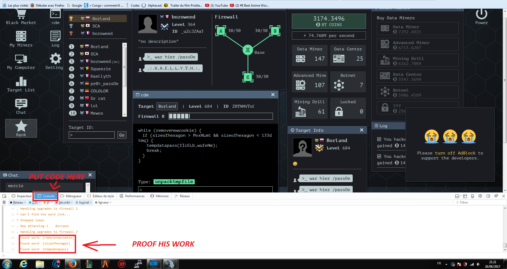
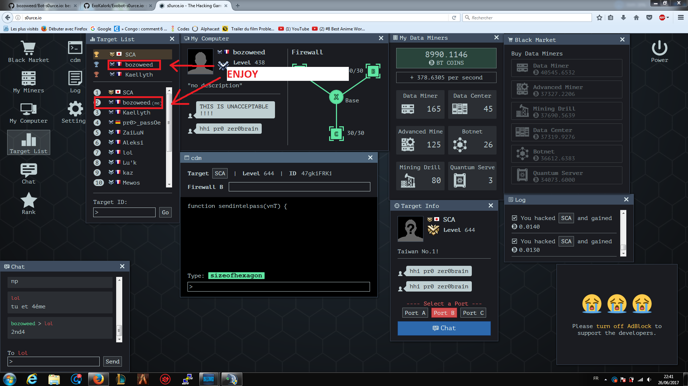

# Bot-s0urce.io
A bot to automatically play s0urce.io for you

## Features
- auto buy miner
- auto upgrade firewall
- auto target 
- auto recharge firewall
- gui interface

## Configuration

The main file (`main.js`) contains several values you may want to change.

* `ocrApiKey` - The key for the ocr.space API (it's free)
* `db` - The path to the training JSON
* `message` - The message you send to people after you hack them
* `wordFreqMin` - How often to guess words minimum.  If you guess too fast, you'll be booted from the game and your progress will no longer update. ( change at line 45 and 98 )
* `wordFreqMax` - How often to guess words maximu.
* `mineFreq` - How often to purchase upgrades for BT miner.
* `upgradeFreq` - How often to purchase upgrades for Firewall. ( Not work for now need to work on it )
* `minerLevel` - How high you get your miners to before moving to the next level up.
* `playerToAttack` - The index of the player you want to attack, 0 is the first in the list

## How To Use

> Note: This bot is my update of an other one in git but his dev don't know what he do

> Note 2: My bot work with all web browser , you can help me to make work better :)

* Go to [http://s0urce.io/](http://s0urce.io/) and start a game.
* Open the Console (Under View -> Developer -> JavaScript Console) 
* Paste in the full contents of `main.js`
* Select Firewall (A)
* Type `app.start()` to start the automated bot
* If you need to stop, you can make that with gui
* You can restart if is buged with the gui
* You can change in real time the hack speed ( change the first only , with double click )

## ENJOY

